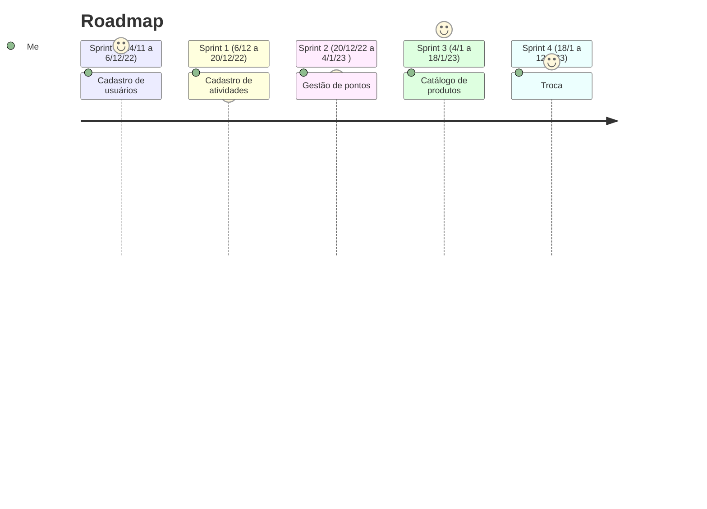

# Contribuições 🛹

Para contextualizar com a aplicação leia a [História sobre a Capina](./historia/capina.md) realizada em um espaço que está sendo revitalizado pela associação.

## Para estimar as tarefas abaixo vamos utilizar o método [T-Shirt Size](https://asana.com/pt/resources/t-shirt-sizing)

Fica acordado a seguinte tabela para tamanhos e durações

| Tamanho | Duração
| ---     | ---
| P       | 1 dia
| M       | 2 dias
| G       | 4 dias
| XG      | 8 dias

Fica acordado a disponibilidade de 1,5 horas por dia não considerando finais de semana, e feriados.

## Épicos

|Nome | Duração (Dias)| Status
|--- | --- | ---
|[Cadastro de usuários](./epicos/cadastro_de_usuarios.md) | 13 | A fazer
|[Cadastro de atividades](./epicos/cadastro_de_atividades.md) | 10 | Dominio concluido
|[Gestão de pontos](./epicos/gestao_de_pontos.md) | 11 | A fazer
|[Troca](./epicos/troca.md) | 12 | A Fazer
|[Catálogo de produtos](./epicos/catalogo_de_produtos.md) | 14 | A fazer

***Estimativa***: 60 dias

***Valor**: R$##.##0.00

## Sprints

As sprint's teram a duração de 11 dias úteis.

Ao final de cada sprint preencher a planilha de retrospectiva.
A partir da final da segunda sprint coletar feedback dos usuários.

## Repositório

## Gestão Visual()
