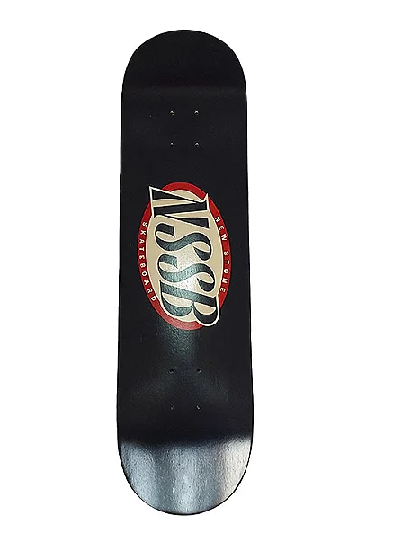
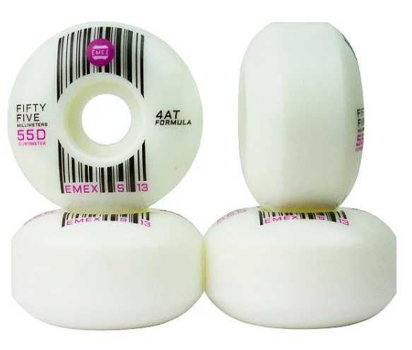
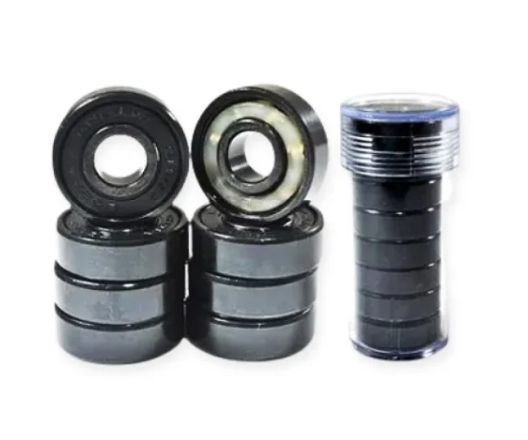

# Catálogo de produtos

[voltar](../README.md)

---

## Funcionalidades

| Nome | Observação | Tamanho
| --- | --- | ---
| Incluir | | P
| Excluir | | P
| Bloquear | | P
|Alterar pontos | | P
| Upload fotos | | G
|Status |Disponível, Bloqueado, Acabou | P
| Todos Produtos | | G
| Atualizar quantidade | | P

**Estimativa** : 14 dias

## Definições de pronto

- [história](../historia/capina.md#catálogo-de-produtos)

A consulta **Todos produtos** deve retornar as seguintes informações:

| Produto | Pontos | Fotos | Status | Quantidade
|--- |--- |--- |--- | ---
| Shape | 13 | | Disponível | 4
| Roda | 8 |  | Disponível | 1
| Lixa | 3 |  | Acabou | 0
| Rolamento |2 |  | Bloqueado | 0
